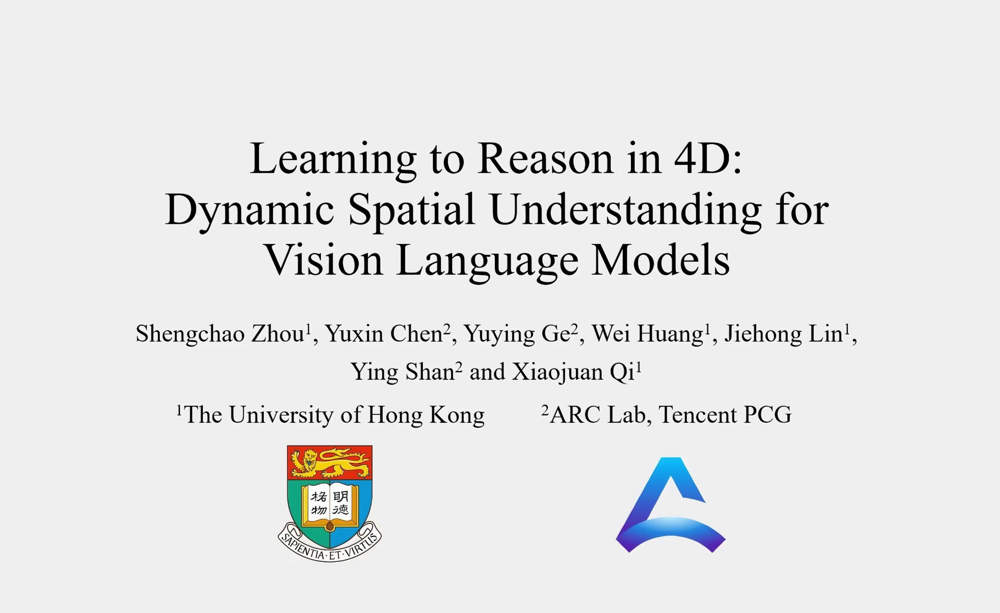
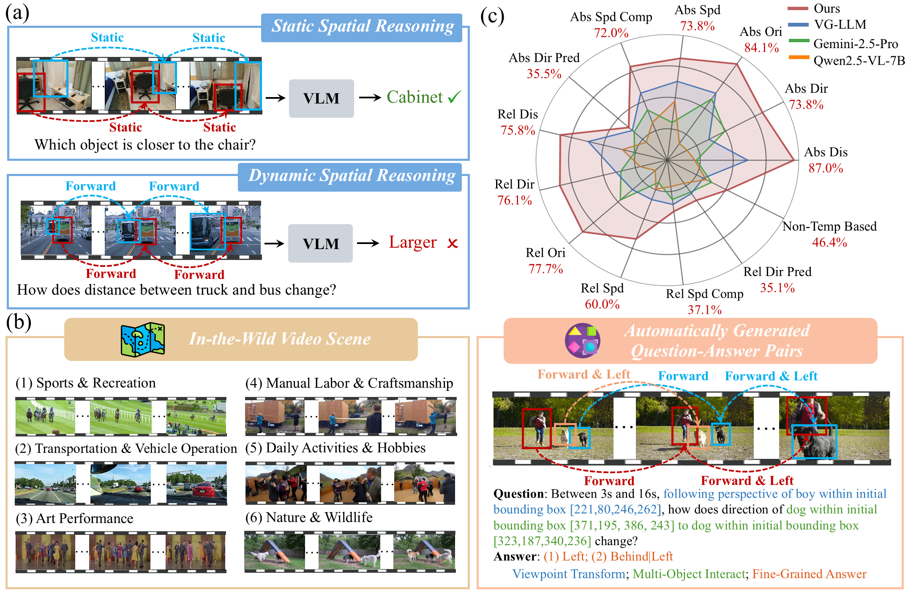


<div align="center">
<h1>Learning to Reason in 4D: Dynamic Spatial Understanding for Vision Language Models</h1>
</div>

<div align="center">
<a href="https://arxiv.org/abs/2512.20557" target="_blank">
    
</a>
<a href="https://huggingface.co/collections/TencentARC/dsr-suite" target="_blank">
    
</a>
</div>

<div align="center">
    <a href="https://scholar.google.com/citations?user=Q5jj-TYAAAAJ&hl=en" target="_blank">Shengchao Zhou</a><sup>1</sup>,</span>
    <a href="https://scholar.google.com/citations?hl=en&user=dEm4OKAAAAAJ" target="_blank">Yuxin Chen</a><sup>2</sup>, </span>
    <a href="https://scholar.google.com/citations?user=hv1LiiEAAAAJ&hl=en&oi=ao" target="_blank">Yuying Ge</a><sup>2</sup>,</span>
    <a href="https://scholar.google.com/citations?user=rZVUlPAAAAAJ&hl=zh-CN" target="_blank">Wei Huang</a><sup>1</sup>,</span>
    <a href="https://scholar.google.com/citations?user=eSkDBYcAAAAJ&hl=zh-CN" target="_blank">Jiehong Lin</a><sup>1</sup>,</span>
    <a href="https://scholar.google.com/citations?hl=en&user=bGn0uacAAAAJ&view_op=list_works&sortby=pubdate" target="_blank">Xiaojuan Qi</a><sup>1</sup>,</span>
</div>

<div align="center">
    <sup>1</sup>The University of Hong Kong&emsp;
    <sup>2</sup>ARC Lab, Tencent PCG&emsp;
</div>

<div align="center">

[](https://www.youtube.com/watch?v=ps8wzm8kDC0)

</div>

We introduce **DSR Suite**, which consists of an automated data generation pipeline that constructs multiple-choice question answer pairs (QAs) for ***dynamic spatial reasoning*** task and a module that seamlessly integrates geometric priors from 3D foundation models into VLMs without hindering their general understanding capability. With in-the-wild videos, randomly selected viewpoints, target objects, predefined templates and answer derivation rules, the generated QAs can evaluate object- and scene-level 3D understanding, multi-object interactions, viewpoint transformations and fine-grained temporal reasoning in general dynamic scenes. Based on the pipeline, we generate: (1) **DSR-Train**, a training dataset with 50K QAs; (2) **DSR-Bench**, a benchmark with 1484 QAs further refined by human annotators. In addition to data, we introduce **Geometry Selection Module** (GSM) that is stacked with two Q-Formers, where the first Q-Former condenses question semantics and the second Q-Former extracts question-relevant knowledge from 3D foundation models into a compact set of geometry tokens that will be concatenated with vision tokens.  When integrated with our GSM, the spatial reasoning ability of a VLM will improve while its general understanding performance is preserved. 

<p align="center" width="100%">

</p>

## Table of Contents
1. [News](#news)
2. [Data Generation](#data-generation)
3. [Model Training](#model-training)
4. [Citation](#citation)
5. [Acknowledgement](#acknowledgement)

## News
- [x] [2025.7.10] We release [Paper](https://arxiv.org/abs/2512.20557) and this GitHub repo [DSR_Suite](https://github.com/TencentARC/DSR_Suite).


## Data Generation
Please refer to `data/README.md` for details of automated data generation pipeline. Since there are some differences between the packages of "data generation" and "model training", we recommend two different installations. 

## Model Training
Please refer to `model/README.md` for details of training the model with GSM. Since there are some differences between the packages of "model training" and "data generation", we recommend two different installations.

## Citation
If you find our work useful, please consider citing:

```bibtex
@misc{zhou2025learning,
      title={Learning to Reason in 4D: Dynamic Spatial Understanding for Vision Language Models}, 
      author={Shengchao Zhou, Yuxin Chen, Yuying Ge, Wei Huang, Jiehong Lin, Ying Shan, Xiaojuan Qi},
      year={2025},
      eprint={2512.20557},
      archivePrefix={arXiv},
      primaryClass={cs.CV},
      url={https://arxiv.org/abs/2512.20557}, 
}
```
## Acknowledgement
- [Qwen2.5-VL](https://github.com/QwenLM/Qwen3-VL): the model codebase we built upon.
- [VLMEvalKit](https://github.com/open-compass/VLMEvalKit): the evaluation framework we built upon.
- [Grounded SAM2](https://github.com/IDEA-Research/Grounded-SAM-2), [Orient Anything](https://github.com/SpatialVision/Orient-Anything), [π^3](https://github.com/yyfz/Pi3): the models used in our data generation pipeline to extract 3D cues.
- [Koala-36M](https://github.com/KlingTeam/Koala-36M): the video database we build QAs upon.